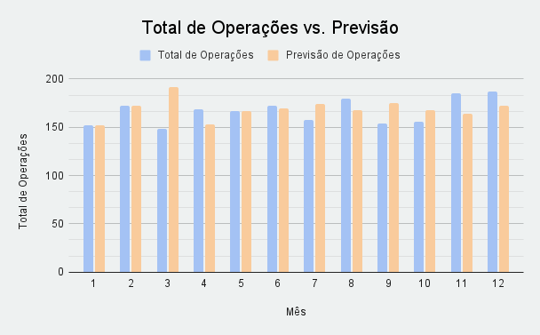

# 📈 Análise do Mercado de Ações

Este projeto apresenta uma análise exploratória de dados do mercado de ações,
com foco em operações de compra e venda, comportamento temporal dos ativos
e avaliação de lucro ou prejuízo por cliente.

O objetivo é aplicar conceitos de análise de dados utilizando Excel/Google Sheets,
explorando estatísticas descritivas, segmentação de clientes e visualizações
gráficas para geração de insights.

---

## 🎯 Objetivos da Análise
- Analisar o comportamento de compra e venda de ativos
- Identificar tendências temporais do mercado
- Avaliar desempenho financeiro (lucro/prejuízo)
- Analisar o perfil e resultado por cliente
- Gerar visualizações claras para apoio à tomada de decisão

---

## 🧱 Estrutura do Projeto

```text
analise-mercado-acoes/
│
├── data/
│   └── analise_mercado_acoes.xlsx
│
├── images/
│   ├── grafico_tendencia_temporal.png
│   ├── grafico_compra_venda.png
│   └── grafico_lucro_prejuizo_cliente.png
│
└── README.md
```

## 🔍 Etapas da Análise

## 1️⃣ Dados do Mercado

Conjunto de dados contendo informações sobre ativos do mercado de ações,
incluindo registros de operações e valores financeiros associados.

## 2️⃣ Estatísticas Descritivas

- Análise estatística para compreender:
- Distribuição dos valores
- Médias, mínimos e máximos
- Comportamento geral do mercado

## 3️⃣ Operações de Compra e Venda

Avaliação do volume e padrão das operações realizadas,
permitindo identificar momentos de maior atividade e possíveis estratégias.

## 4️⃣ Tendência Temporal

Análise da evolução dos dados ao longo do tempo,
identificando tendências e possíveis variações sazonais.

## 5️⃣ Análise por Cliente
Segmentação dos clientes para avaliar:
- Volume de operações
- Resultado financeiro
- Clientes com maior lucro ou prejuízo

## 📊 Principais Visualizações

- 📈 Tendência Temporal do Mercado
  - Visão analítica
  
    
- 🔄 Distribuição de Compra e Venda
  - Mostra comportamento operacional
  
  
- 💰 Lucro e Prejuízo por Cliente
  - Mostra análise financeira + segmentação
  

### 🛠️ Como reproduzir a análise

1. Abra o arquivo `/data/analise_mercado_acoes.xlsx`
2. Abra a aba `analise_temporal`
3. Veja os gráficos na aba `visualizacoes`

## 📁 Dados Utilizados

Os dados completos, incluindo todas as análises e gráficos,
estão disponíveis no arquivo Excel:
- 📂 data/analise_mercado_acoes.xlsx

## 🛠️ Ferramentas Utilizadas

- Microsoft Excel/Google Sheets
- Análise exploratória de dados
- Estatística descritiva
- Visualização de dados

## 📌 Conclusão

Este projeto demonstra a aplicação prática de análise de dados em um cenário
financeiro, explorando dados reais de mercado e apresentando insights
por meio de visualizações claras e organização estruturada,
sendo ideal para compor um portfólio de Analista de Dados.
